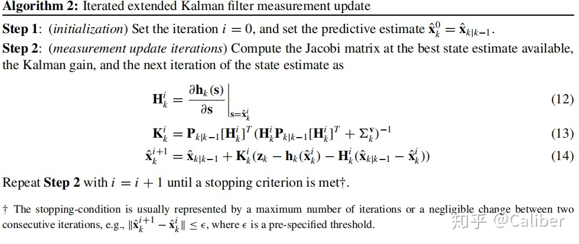

### 目的
1. 从 An EKF for Lie Groups with Application to Crane 和 概率机器人 重新来看EKF更新:
   
   这个问题是EKF处理SO3群的时候，在流形上进行的更新，本来不应该满足 一般EKF的更新方式

   所以需要对EKF重新审视。

### 过程

1. EKF更新 就是 优化(MLE)

   这一点是从概率机器人上就可以得到的。
   更加精细得讲，EKF 用的就是 两个高斯分布混合之后还是一个高斯分布的 现象。

   使用公式进行刻画

   $$
    
    ||z\boxminus h(x)||_{\Sigma_{obs}}^2 + ||x-\mu_{k+1|k}||_{\Sigma_{P_{k+1|k}}}^2
    \\
    = ||res_{obs}||_{\Sigma_{obs}}^2 + ||res_{regularization}||_{\Sigma_{P_{k+1|k}}}^2
    \\
    \And
    \\
    x_{init} = \mu_{k+1|k}
   $$

   在以上的公式的基础上，可以得到第一次迭代的 Hessian 和 Gradient 的结论为

   $$

    Hessian = (H^T\Sigma_{obs}H + \Sigma_{P_{k+1|k}})
    \\
    Gradient = -H^T\Sigma_{obs}res_{obs} + \Sigma_{P_{k+1|k}}res_{regularization}
    \\
    res_{regularization}=0

   $$

    更新量为:
   $$

    \Delta x = -(J^T\Sigma_{obs}J + \Sigma_{P_{k+1|k}})^{-1}J^T\Sigma_{obs}res_{obs}

   $$

对应EKF中的量:

 $$

    \Delta x = \Sigma_{P_{k+1|k}}^{-1}H^T(H\Sigma_{P_{k+1|k}}^{-1}H^T+\Sigma_{obs}^{-1})^{-1}res_{obs}

   $$

   基于 matrix inverse lemma 可以证明存在以下关系:

   $$

(H^T\Sigma_{obs}H + \Sigma_{P_{k+1|k}})^{-1}H^T\Sigma_{obs} = \Sigma_{P_{k+1|k}}^{-1}H^T(H\Sigma_{P_{k+1|k}}^{-1}H^T+\Sigma_{obs}^{-1})^{-1}
   
   $$

   当然这里差了一个正负号这件事，最主要的原因是
   在 R_n 上的EKF 主要是使用
   $$
    Z-H(x)
   $$

    在优化框架里，计算上H之前的符号之后

$$

    J = -H  
    $$
    
    这样也就是把上面的那个符号的问题说明白了

1. 关于之前对于EKF SO3 左更新还是右更新的疑惑
   
   实际上在优化框架上，就有了一个非常基本的结论也就是说看求导的方式。

### 关于方差的更新

EKF更新方式:

   Based on Inverse Matrix Lemma
$$
   (A+BDC)^{-1} = A^{-1} - A^{-1}B(D^{-1}+CA^{-1}B)^{-1}CA^{-1}
$$

$$

   \Sigma_{P_{k+1|k+1}}^{-1} = (I - KH)\Sigma_{P_{k+1|k}}^{-1}
   \\
   \Sigma_{P_{k+1|k+1}}^{-1} = \Sigma_{P_{k+1|k}}^{-1} - \Sigma_{P_{k+1|k}}^{-1}H^T(H\Sigma_{P_{k+1|k}}^{-1}H^T+\Sigma_{obs}^{-1})^{-1}H\Sigma_{P_{k+1|k}}^{-1}
   \\
   \Sigma_{P_{k+1|k+1}}^{-1}=(H^T\Sigma_{obs}H+\Sigma_{P_{k+1|k}})^{-1}
$$

以上说明了 使用优化框架的Hessian 对 EKF 的方差进行更新的合理性

### 关于 so3 映射出的 R_3 的角速度更新

可以参考
An EKF for Lie Groups with Application to Crane

### 关于 IEKF

IEKF 和 优化并不等价。
IEKF 的观测进行迭代的时候，线性化点会发生变化。认为IEKF不会有EKF的稳定性。
如果想要让IEKF有相同的稳定性，目前认为需要固定线性化点。

突然发现原来是自己记错了， IEKF 存在对于 X 的修正项，这种情况下，IEKF和优化等价

### 欧拉角速度转 omega

